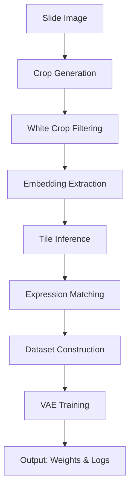

# Deepspot-VAE
Inference Xenium matrix using H&amp;E foundation model &amp; imputation matrix with VAE 

```mermaid
flowchart TD
    A[Slide Image] --> B[Crop Generation]
    B --> C[White Crop Filtering]
    C --> D[Embedding Extraction]
    D --> E[Tile Inference]
    E --> F[Expression Matching]
    F --> G[Dataset Construction]
    G --> H[VAE Training]
    H --> I[Output: Weights & Logs]
```
