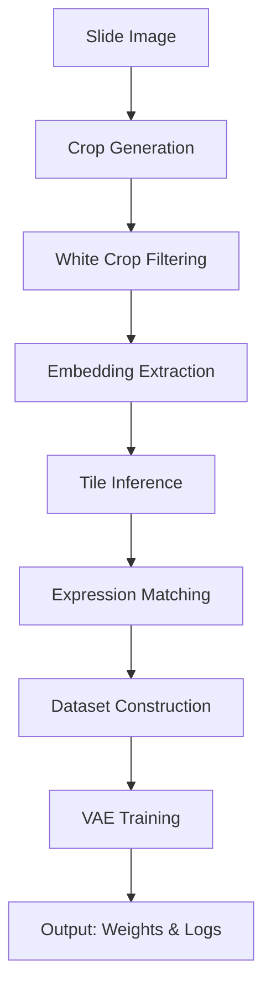

# Deepspot-VAE
Inference Xenium matrix using H&amp;E foundation model &amp; imputation matrix with VAE 

# Image Encoder
The image encoder is UNI(https://github.com/mahmoodlab/UNI, the H&E foundation model (SSL settings)) based.

* not using the "Rho", predictor for gene expression.

# VAE
Using VAE for reconstruction & imputation for Xenium gene expression matrix

# Code Flow

