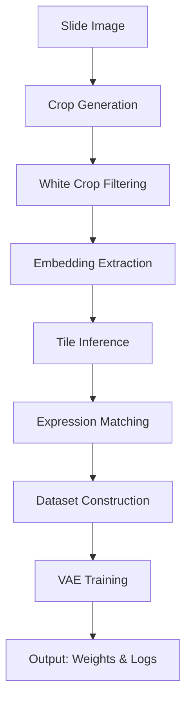

# Deepspot-VAE
Inference Xenium matrix using H&amp;E foundation model &amp; imputation matrix with VAE 

# Image Encoder
The image encoder is UNI(https://github.com/mahmoodlab/UNI, the H&E foundation model (SSL settings)) based.

* not using the "Rho", predictor for gene expression.

# VAE
Using VAE for reconstruction & imputation for Xenium gene expression matrix

# Code
    1. python imagefeature_extraction.py
    2. python image_encoder_extration.py
    3. python vae_train.py

# Code Flow

# Alignment final & Image tiling
Have to scaling our images & GT st spots! (!!!!Need Polygon of ST!!!!)

now we using 30x30 tiles. but have to use 224x224 -> if overlapped, just think it as "biological context" (30x30 tiles also could contains 2 or more spots)

